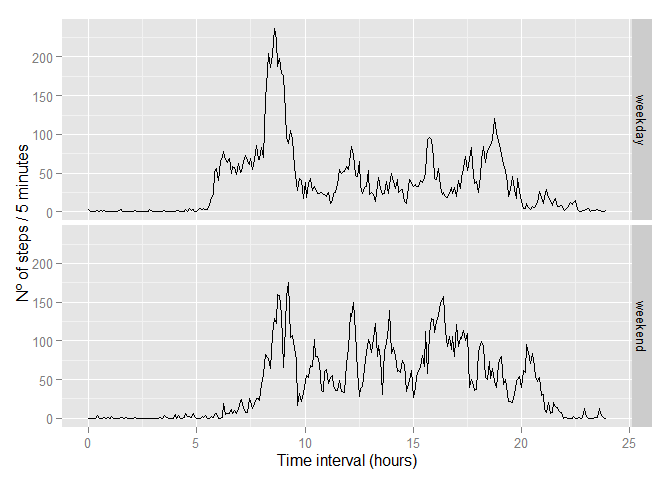

# Reproducible Research: Peer Assessment 1
### Loading and preprocessing the data

This section shows the code chunks to load and preprocess the data for analysis. The interval column is the one that needs the most processing.


```r
data <- read.csv("activity.csv", header=TRUE)
data$date <- as.Date(data$date, format="%Y-%m-%d")

## Interval will be expressed as a number of hours.
hours <- data$interval %/% 100
minutes <- data$interval %% 100
data$interval <- (hours + minutes/60)

## Since we'll be ignoring missing values at first, let's eliminate those rows.
dataNoNA <- data[complete.cases(data),]
```

### What is mean total number of steps taken per day?  
How many steps does the individual take per day? After calculating the total number of steps per day (ignoring missing values), let's examine a histogram to see the pattern of those values.


```r
totalSteps <- tapply(dataNoNA$steps, dataNoNA$date, sum)
hist(totalSteps, col="blue", xlab="Total steps per day", ylab="Frequency",
     main=NULL)
```

 

```r
meanSteps <- as.integer(mean(totalSteps))
medianSteps <- median(totalSteps)
```

As we can see from the histogram, the daily total of steps is most commonly between 10000 and 15000. The mean number is 10766 and the median is 10765.

### What is the average daily activity pattern?

Time to look at how the activity differs according to the time of the day. So, how many steps does this guy take, let's say, between 11:30 and 11:35 on average each day? And I ask the same question about all times of the day.  
No better way to look a this than with a line plot.


```r
timeAvg <- aggregate(steps~interval, data=dataNoNA, FUN=mean)

## ggplot2 is a nice library for plots
library(ggplot2)
qplot(interval, steps, data=timeAvg, geom="line", xlab="Time of day (hours)",
      ylab="Average number of steps / 5 minutes", xlim=c(0,24))
```

 

```r
maxInterval <- timeAvg[timeAvg$steps==max(timeAvg$steps),"interval"]
hours <- trunc(maxInterval)
minutes <- (maxInterval-hours)*60
maxInterval <- paste(hours, minutes, sep=":")
```

On average, the highest number of steps is taken during the 5-minute interval starting at 8:35.

### Imputing missing values

The dataset has a high number of missing values, which may affect the calculations of means, totals and so on. It might be helpful to fill the missing data in order to perform the analysis, but first we need to see how many missing values we have and where they are.  


```r
sum(is.na(data$steps))
```

```
## [1] 2304
```

So, the number above represents the total number of missing values. Before we decide how to fill them, let's see how they are distributed. Are they concentrated on a certain time interval? Are there entire days with missing data? The graphs below will help answer the questions.


```r
par(mfrow=c(1,2))
missing <- is.na(data$steps)

## Functions below will calculate the fraction of NA values per time interval
## and per date.
percNATime <- tapply(missing, data$interval, mean)
percNADate <- tapply(missing, data$date, mean)
plot(rownames(percNATime), percNATime, type="l", ylim=c(0,1),
              ylab="Fraction of missing values", xlab="Interval (hours)")
barplot(percNADate, ylab="Fraction of missing values", xlab="Date")
```

 

The graphs make it absolutely clear: all time intervals have the same number of missing values and some dates have 100%, while others have 0. That means, whenever a value is missing, it is missing for the entire day.  
So, personally, my strategy for filling those missing values would be *not to fill them at all*, just toss away those days and calculate statistics with the remaining ones. But the assignment tells me to fill them, so, I'll do it.  
It only makes sense that the individual's activity pattern vary according to the day of the week, so, each interval with missing values will receive the mean value of the same interval on the same weekday. I.e., if a Monday 8:30 value is missing, it will receive the average 8:30 value from the other Mondays.


```r
## Preparing the data with a column to tell the day of the week.
data$wDay <- weekdays(data$date, abbreviate=TRUE)

## Calculating the mean for every weekday and filling missing data.
wDayMean <- aggregate(steps~wDay+interval, data, mean, na.rm=TRUE)
dataFill <- data
for(i in 1:nrow(dataFill)) {
      if(is.na(dataFill[i,"steps"])) {
            index <- wDayMean$wDay == dataFill[i,"wDay"] &
                  wDayMean$interval == dataFill[i,"interval"]
            dataFill[i,"steps"] <- wDayMean[index,"steps"]
      }
}

## Making histogram
totalSteps <- tapply(dataFill$steps, dataFill$date, sum)
hist(totalSteps, col="blue", xlab="Total steps per day (missing data filled)",
     ylab="Frequency", main=NULL)
```

 

```r
meanSteps <- as.integer(mean(totalSteps))
medianSteps <- as.integer(median(totalSteps))
```

This new histogram looks very much like the previous one and it shows us that, after filling missing values with the above-mentioned strategy, the daily total of steps still has its most common value between 10000 and 15000. The mean number becomes 10821 and the median changed to 11015. A shift in those values was expected, since, in the new dataset, the proportion between weekdays has changed.

### Are there differences in activity patterns between weekdays and weekends?

As one would deduce intuitively, yes. Look at the graphs:


```r
#Another amount of data preparation is necessary: identifying weekend and weekdays
dataFill$wDay.wEnd[dataFill$wDay %in% c("Mon","Tue","Wed",
                                        "Thu","Fri")] <- "weekday"
dataFill$wDay.wEnd[dataFill$wDay %in% c("Sat","Sun")] <- "weekend"
dataFill$wDay.wEnd <- as.factor(dataFill$wDay.wEnd)

# And now, the plot!
plotData<-aggregate(steps ~ interval+wDay.wEnd, data=dataFill, mean)
qplot(interval, steps, data=plotData, geom="line", xlab="Time interval (hours)",
      ylab="Nº of steps / 5 minutes") +
      facet_grid(wDay.wEnd~.)
```

 

They show a peak number of steps during earlier hours on the weekdays and, for the rest of the day, reduced activity in comparison with the weekends. Just what one would expect from a person who sits all day at an office during the week and is free to roam around on weekends.

This report was generated on 2015-09-16.
